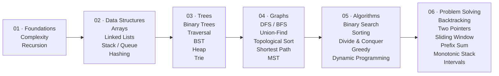

# DSA Learning Log

My personal **Data Structures & Algorithms** learning repository.

It contains structured notes, Python implementations, flowcharts, and problem solutions,, along with problems from  **[Labuladong's Algorithm Roadmap](https://labuladong.online/en/roadmap/algo/)** **Aditya Verma, and NeetCode**.

All solutions and implementations are written in **Python**.

---

## Prerequisites

- **Python Fundamentals**
- **DSA Foundations:** [Grokking Algorithms](./Resources/grokking-algorithms-illustrated-programmers-curious.pdf)

### **Quick Reference**

A small collection of implementations for common **ADTs and data structures**.
These are reference implementations, not a separate prerequisite.

#### ADTs

- [List / Sequence](./Reference/ADT/list.ipynb)
- [Stack](./Reference/ADT/stack.ipynb)
- [Queue](./Reference/ADT/queue.ipynb)
- [Deque](./Reference/ADT/deque.ipynb)
- [Set](./Reference/ADT/set.ipynb)
- [Map / Dictionary](./Reference/ADT/map.ipynb)
- [Priority Queue](./Reference/ADT/priority_queue.ipynb)

#### Core Data Structures

- [Dynamic Array](./Reference/dynamic_array.ipynb)
- [Linked List](./Reference/linked_list.ipynb)
- [Doubly Linked List](./Reference/doubly_linked_list.ipynb)
- [Hash Table](./Reference/hash_table.ipynb)
- [Binary Tree](./Reference/binary_tree.ipynb)
- [Binary Search Tree](./Reference/binary_search_tree.ipynb)
- [Heap](./Reference/heap.ipynb)
- [Graph](./Reference/graph.ipynb)
- [Trie](./Reference/trie.ipynb)

---

## Roadmap

The roadmap follows the general structure of **[Labuladong's Algorithm Roadmap](https://labuladong.online/en/roadmap/algo/)**, while the repository tracks my own progress through it.

## Data Structures

- [Arrays](./DataStructures/Arrays/)
- [Linked Lists](./DataStructures/LinkedLists/)
- [Stack & Queue](./DataStructures/StackQueue/)
- [Hashing](./DataStructures/Hashing/)
- [Trees](./DataStructures/Trees/)
- [Heap](./DataStructures/Heap/)
- [Trie](./DataStructures/Trie/)
- [Graphs](./DataStructures/Graphs/)

## Algorithms

- [Binary Search](./Algorithms/BinarySearch/)
- [Sorting](./Algorithms/Sorting/)
- [Divide & Conquer](./Algorithms/DivideAndConquer/)
- [Backtracking](./Algorithms/Backtracking/)
- [Greedy](./Algorithms/Greedy/)
- [Dynamic Programming](./Algorithms/DynamicProgramming/)

## Resources

- [Grokking Algorithms](./Resources/grokking-algorithms-illustrated-programmers-curious.pdf)
- [Labuladong Algorithm Roadmap](https://labuladong.online/en/roadmap/algo/)
- [Aditya Verma](./Resources/aditya-verma.md)
- [LeetCode](./Resources/leetcode.md)
- [NeetCode](./Resources/neetcode.md)
